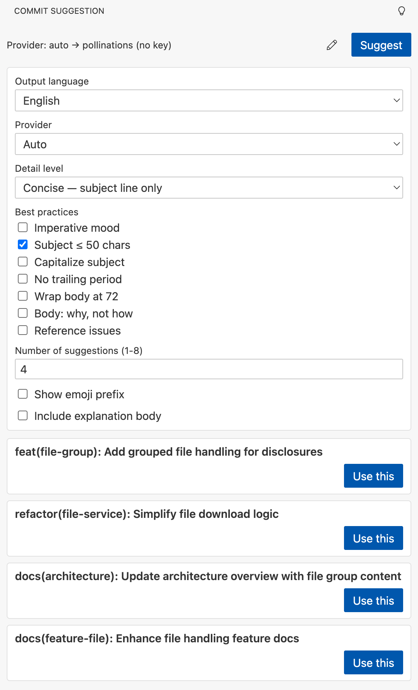

# Git Commit Suggestion

Stop staring at a blank commit message. Stage your changes, click **Suggest**, and get 3–8 Conventional Commits proposals to pick from.



## Features

- **Zero setup.** The default provider needs no API key — it just works on the first launch.
- **21 output languages.** English, Vietnamese, 简体中文, 繁體中文, 日本語, 한국어, Español, Français, Deutsch, Português, Русский, Bahasa Indonesia, ภาษาไทย, العربية, हिन्दी, Italiano, Türkçe, Polski, Nederlands, Українська, Svenska. The entire panel switches language with one dropdown.
- **Conventional Commits aware.** Type / scope / subject / body are generated according to your chosen best-practice rules: imperative mood, subject ≤ 50 chars, capitalize, no trailing period, wrap body at 72, body explains *why* (not *how*), reference issues.
- **Three detail levels.** Subject only, subject + brief body, or full multi-paragraph explanation.
- **BYOK when you want better quality.** Paste a key for Mistral, OpenAI, Anthropic, or Groq in the inline settings panel — no JSON editing required.
- **One-click commit.** *Use this* drops the formatted message straight into the Source Control input box. Review and commit normally.

## Getting started

1. Install the extension.
2. Open a Git repository in VSCode.
3. Click the **lightbulb-on-phone icon** in the Activity Bar (left edge).
4. Stage at least one file (`git add ...` or click `+` next to a file in Source Control).
5. Click **Suggest**. Wait a couple of seconds.
6. Click **Use this** on the suggestion you like. Review the commit message in the Source Control input. Press **Commit**.

That's it. No keys, no setup.

## Settings

Click the ✏️ button in the panel header to open inline settings:

| Setting | Default | What it does |
|---------|---------|--------------|
| **Output language** | English | The language used for everything — UI labels, generated commit messages, error text. |
| **Provider** | Auto | Pick which LLM to call. *Auto* tries free providers in order and returns the first success. |
| **Detail level** | Normal | *Concise* = subject only, *Normal* = subject + brief body, *Detailed* = subject + multi-paragraph explanation. |
| **Best practices** | 5 of 7 | Toggle individual Conventional Commits rules. Each rule maps to a line of guidance fed to the LLM. |
| **Number of suggestions** | 4 | Between 1 and 8. |
| **Show emoji prefix** | on | Prepends ✨🐛📝… according to the commit type. |
| **Include explanation body** | on | Turn off for subject-only commit messages. |

Advanced settings (model overrides, custom prompts, diff truncation budget, unofficial provider gate) are exposed in VSCode's standard Settings under **Extensions → Git Commit Suggestion**.

## Bring your own key (optional)

The default *Auto* mode does not need a key. If you want to use **Mistral**, **OpenAI**, **Anthropic**, or **Groq**:

1. Select the provider in the inline settings panel.
2. A banner appears: *"API key required"*. Click **Paste my key**.
3. Enter your key once — it's stored securely in VSCode's `SecretStorage` (never in `settings.json`).

The key is per-machine and never synced.

Free keys you can grab in 60 seconds:
- **Mistral** — `console.mistral.ai` → API Keys
- **Groq** — `console.groq.com` → API Keys
- **OpenAI** / **Anthropic** — paid only

## Privacy

- The extension sends your **staged diff** and a short prompt to whichever provider you selected. Nothing else.
- No telemetry, no analytics, no third-party tracking from the extension itself. (The LLM provider has its own policies — check theirs if your diffs contain sensitive code.)
- API keys live in VSCode `SecretStorage`. They are encrypted per-machine.
- All settings stay in your local `settings.json`. Nothing is written anywhere else.

For private repos with sensitive code: use **Mistral** or **Anthropic** with your own key, since their commercial terms forbid training on API content. *Auto* mode uses free community providers whose terms vary — review them before exposing private codebases.

## Commands

| Command (palette) | What it does |
|-------------------|--------------|
| `Git Commit Suggestion: Suggest Commit Message` | Generate suggestions. Works even when the sidebar is hidden — falls back to a QuickPick. |
| `Git Commit Suggestion: Set API Key for Provider` | Store a key in SecretStorage. |
| `Git Commit Suggestion: Clear API Key for Provider` | Remove a stored key. |

## Troubleshooting

| Symptom | Fix |
|---------|-----|
| "Not inside a git repository" | Open a folder that contains a `.git` folder. The extension walks up from the workspace root to find one. |
| "No staged changes" | Stage at least one file with `git add` or the `+` button in Source Control. |
| Empty Source Control input box after *Use this* | Make sure the built-in `vscode.git` extension is enabled. As a fallback, the message is copied to the clipboard. |
| All providers in *Auto* fail | A community provider may be down. Switch to a BYOK provider (Mistral has a free tier). |
| Subject is in the wrong language | Re-pick the output language from the dropdown and click *Suggest* again. |

## Publishing

If you forked this and want to publish your own version to the Marketplace:

```bash
# One-time setup
npm install -g @vscode/vsce

# Create a Personal Access Token at https://dev.azure.com → User → Personal Access Tokens
#   Scope: Marketplace → Manage
# Then create a publisher at https://marketplace.visualstudio.com/manage and
# log in:
vsce login <your-publisher-id>

# Verify the package contents (dry run):
vsce package
# Inspect the produced .vsix in any zip viewer.

# Publish:
vsce publish
# or with explicit version bump:
vsce publish patch    # 0.1.0 → 0.1.1
vsce publish minor    # 0.1.0 → 0.2.0
```

Before first publish, edit `package.json`:
- `publisher`: your Marketplace publisher id (not your GitHub username).
- `repository.url`, `bugs.url`, `homepage` (optional but recommended).
- `version`: starts at `0.1.0`.

The Marketplace lists files matching `.vscodeignore` so the .vsix stays small (excludes `src/`, `test/`, `node_modules/`, source maps).

## Contributing

Developer guide and architecture notes live in [CONTRIBUTING.md](CONTRIBUTING.md). Provider quirks and gotchas are in [docs/knowledge-base.html](docs/knowledge-base.html).

## License

MIT.
